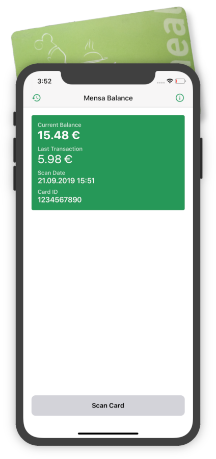

# Mensa-Guthaben iOS

With this app you can read the current balance of your mensa card.

## Screenshot

## System Requirements
- iPhone 7 or newer
- iOS 13 or newer

## Successfully Tested Cards
* TU Dresden (Studentenwerk Emeal card and TU Campuscard!)
* Uni Leipzig
* HS/Uni Flensburg (Studentenwerk SH)
* TU Darmstadt
* Uni Trier
* Uni Greifswald
* Leibniz Universität Hannover
* Ruhr-Uni Bochum
* h_da (hochschule darmstadt)
* THOSKA der Bauhaus-Universität Weimar, Hochschule für Musik „Franz List“ Weimar
* THOSKA der Uni Jena
* TU Ilmenau
* Uni Bielefeld
* Hochschule der Medien, Stuttgart
* Uni Stuttgart
* Uni Hohenheim
* Martin-Luther-Universität Halle-Wittenberg
* Hochschule Furtwangen (HFU)
* Studierendenwerk Freiburg-Schwarzwald (SWFR)
* Otto-von-Guericke Universität Magdeburg
* Deutsche Sporthochschule
* Uni Würzburg
* Universität Oldenburg
* Jadehochschule Oldenburg/Wilhelmshaven/Elsfleth
* Hochschule Emden/Leer
* Hochschule Koblenz
* HAW Hamburg
* FH Erfurt
* TU Braunschweig
* Otto-Friedrich Universität Bamberg
* HS/Uni Bremen
* Christian-Albrechts-Universität zu Kiel

## Contributing
I'm happy if you want to contribute. Please open an issue if you want to:
- report a bug / feedback
- add new card to the list of supported universities

## Used by
Code of this project is used in the following applications:
* [Mensa Dresden](https://github.com/kiliankoe/MensaDresden) / [EmealKit](https://github.com/kiliankoe/EmealKit)
